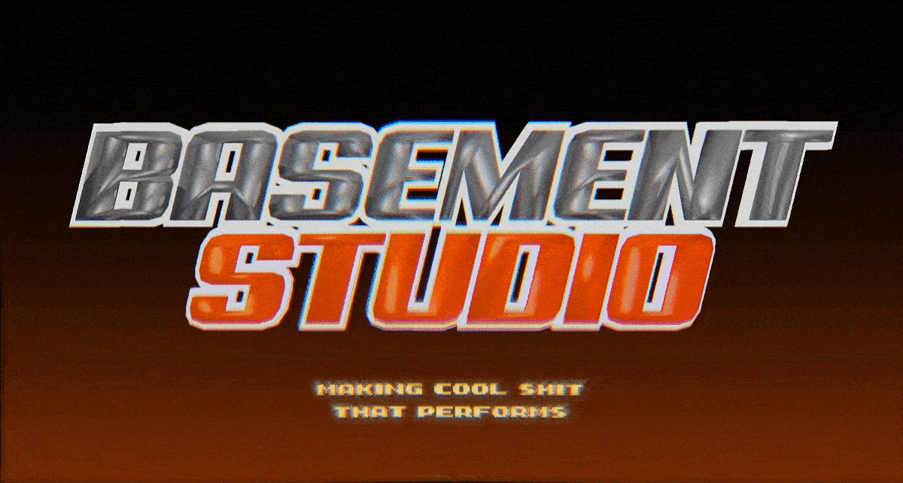

# Basement Studio Website 2025



## A digital studio & branding powerhouse making cool shit that performs.

We partner with the world’s most ambitious startups, scale-ups and brands to unlock their true potential and growth through the convergence of creativity, design, and technology. Follow us on [X](https://twitter.com/basementstudio) and [Instagram](https://www.instagram.com/basementdotstudio) to see our latest work.

Check out the live website at [basement.studio](https://basement.studio)

## Local replica

This checkout is a local-only reference implementation. Replace the Basement
brand, copy, people, client work, and media before any public deployment.

Requirements:

- Node.js 24
- pnpm 9.15.6

Create `.env.local` with the public content configuration:

```dotenv
NEXT_PUBLIC_SANITY_PROJECT_ID=9syto90m
NEXT_PUBLIC_SANITY_DATASET=production
NEXT_PUBLIC_SANITY_API_VERSION=2026-03-01
LOCAL_REPLICA_SKIP_EXTERNAL_EMBEDS=1
```

Then run:

```bash
pnpm install --frozen-lockfile
pnpm dev
```

Open [http://localhost:3000](http://localhost:3000).
